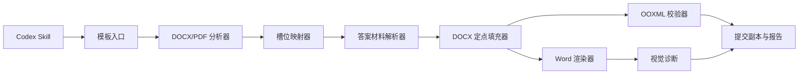

# Assignment DOCX Filler 设计文档

状态：核心确定性脚本已实现；等待 3 份真实脱敏模板完成发布级视觉回归。

## 1. 产品摘要

`assignment-docx-filler` 是面向大学编程作业的 Codex Skill。用户提供教师原始 DOCX、每题代码或文字答案以及真实运行截图；Skill 识别“代码：”“运行结果：”等作答锚点，只修改对应作答区域，生成不覆盖原文件的提交副本。

第一版只承诺 Windows + Microsoft Word 环境下的 DOCX 保真填充。PDF 可作为缺少 DOCX 时的后备模板输入，但不承诺转换为高保真 Word。

## 2. 问题与机会

### 2.1 用户问题

- 直接让 AI 重建 Word 会改变题目顺序、边框、编号、页眉页脚和分页。
- LaTeX 或 Pandoc 适合生成新文档，不适合还原教师现有 DOCX。
- 学生真正需要的是把短代码和真实截图填到指定位置，而不是生成一份全新的课程报告。
- 手工复制代码、调整图片尺寸、检查每一题是否错位的过程重复且容易出错。

### 2.2 市场调研结论

- [Microsoft Word 内容控件](https://learn.microsoft.com/en-us/office/client-developer/word/content-controls-in-word)、Plumsail、Docmosis、Formstack 等成熟方案都采用“保留模板并向结构化区域注入数据”的路线。
- [docxtpl](https://github.com/elapouya/python-docx-template)、[docxtemplater](https://github.com/open-xml-templating/docxtemplater) 和 [Carbone](https://github.com/carboneio/carbone)适合预先标记过的模板，但不能直接解决任意教师模板的作答区域识别。
- [AutoDocX](https://github.com/SHAYANZAWAR/AutoDocX)、[Lab Record Maker](https://github.com/deependrasinghsolanki03-alt/lab-record-maker) 和 [report-generator-skill](https://github.com/alishapuentes278-hub/report-generator-skill)覆盖代码与截图报告生成，但主要生成新文档，没有把“不破坏教师原模板”作为核心约束。

产品差异化应集中在：任意标签型作业模板识别、非破坏式 OOXML 修改、真实截图插入、低置信度确认和模板保真验证。

### 2.3 论文可用性

- [DocLayNet](https://arxiv.org/abs/2206.01062)、[PubLayNet](https://doi.org/10.1109/icdar.2019.00166) 和 [LayoutParser](https://arxiv.org/abs/2103.15348)可辅助 PDF 页面区块识别。
- [LayoutLMv3](https://arxiv.org/abs/2204.08387)可用于复杂视觉文档理解，但第一版不应引入模型训练或推理依赖。
- 有 DOCX 时直接读取 OOXML 的结构和样式比视觉模型更准确、便宜、可解释。论文方案仅保留给 PDF 后备模式和未来复杂模板识别。

## 3. 目标与非目标

### 3.1 第一版目标

- 支持含题号以及“代码/源代码/程序/运行结果/截图”等文字锚点的 `.docx`。
- 识别问题块、代码区域和截图区域，生成槽位映射。
- 接受 AI 生成或用户提供的短代码；用户文件始终优先。
- 接受用户提供的 PNG/JPG/JPEG 截图，每题支持零到多张。
- 只修改作答区域，保留模板其他结构和样式。
- 使用 Word 渲染输出，生成结构与视觉诊断报告。

### 3.2 第一版非目标

- 不自动运行代码、生成截图、补注释、重构或评分。
- 不支持表格作答槽、文本框、复杂公式、加密 DOCX、DOCM 或未处理的修订模式。
- 不承诺 PDF 转 DOCX 保真。
- 不提供 GUI、云端处理、协作编辑或通用报告编排。

## 4. 用户流程

用户最少提供三类输入：

1. `assignment.docx`，缺少时可提供 `assignment.pdf`。
2. `answers/` 中按题号命名的代码文件或直接给出的文字答案。
3. `screenshots/` 中按 `q1-1.png`、`q1-2.png` 命名的真实截图。

Skill 执行：

1. 校验模板是否可安全处理。
2. 分析问题块和作答锚点，生成槽位映射。
3. 自动接受高置信度映射，只询问冲突和低置信度项。
4. 在模板副本中填入代码、文字和截图。
5. 运行结构校验和 Word 渲染检查。
6. 输出 `<原名>_completed.docx`、槽位映射和诊断报告。

重复运行必须从原始模板重新生成，不允许在上一次输出上继续累积修改。

## 5. 系统架构



### 5.1 Skill 编排层

`SKILL.md` 只负责选择 DOCX 或 PDF 后备模式、收集必要输入、调用脚本并解释诊断结果。不可把 XML 修改逻辑写成临时生成代码。

### 5.2 模板入口

- 接受 `.docx` 和后备 `.pdf`。
- 拒绝加密文件、`.docm`、损坏包和未处理的修订模式。
- 记录原文件 SHA-256；任何流程都不得覆盖原文件。

### 5.3 DOCX 分析器

- 读取 `word/document.xml`、样式、编号、节、关系和媒体清单。
- 按文档顺序提取段落文本、样式 ID、表格归属和 XML 定位信息。
- 第一版遇到表格、文本框或复杂嵌套中的候选锚点时标记为不支持，不自动修改。

### 5.4 槽位映射器

问题标题默认匹配：`第 N 题`、`N.`、`N、` 和中文数字题号。文本先做 Unicode NFKC、空白折叠和中英文标点归一化。

锚点分为：

- 代码锚点：代码、源代码、程序、程序代码。
- 截图锚点：运行结果、实验结果、执行结果、截图。

作答区域从锚点后的第一个段落开始，到同一问题块内下一个锚点或下一问题标题前结束。高置信度需要同时满足：精确锚点、位于明确问题块、锚点后存在空白区域、存在可确定边界。置信度低于 `0.85` 或同一区域存在冲突时必须要求用户确认。

### 5.5 答案材料解析器

- `1.py`、`q1.cpp`、`question-1.java` 映射到第一题；显式用户映射覆盖命名推断。
- 代码按 UTF-8 优先读取，失败时尝试系统默认编码并记录警告。
- 不执行代码，不做质量检查，不添加注释。
- 截图接受 PNG/JPG/JPEG；`q1-1.png`、`q1-2.png` 按序映射。
- 缺少截图时保留原占位并在诊断报告中提示，不阻止其他题生成。

### 5.6 DOCX 定点填充器

- 复制原 DOCX 后直接修改副本中的目标 OOXML。
- 保留锚点段落，不修改锚点文字和样式。
- 只删除作答区域中的空白段落和已识别占位文字；遇到教师示例或非空说明时停止并要求确认。
- 代码使用作答区域首个空白段落的段落属性和样式；若模板没有明确代码字体，使用 Consolas，其他属性继承模板。
- 代码以单个段落加换行元素写入，避免为每行创建带额外段距的段落。
- 截图写入普通段落内的内联图片；普通段落中的占位图片会随目标段落内容一起替换。保持宽高比，不裁剪，最大宽度为当前节正文宽度，多张图片纵向排列。图片内容控件和文本框仍标记为不支持。
- 只允许修改 `document.xml` 目标范围以及新增图片所需的关系、媒体和内容类型。页眉、页脚、样式和编号部件必须保持不变。

### 5.7 Word 渲染和验证

- 使用 `pywin32` 启动不可见 Word 实例，以只读方式打开模板和提交副本并导出 PDF。
- 结构校验是主保证：原文件未改变、题目与锚点顺序一致、非目标 OOXML 部件哈希一致、所有预期材料均已插入。
- 同时渲染原模板与提交副本，检查 Word 能否无修复提示打开并导出 PDF、页面尺寸是否保持、是否出现空白页，并记录页数变化。
- 当前自动诊断不把整页像素相似度作为保真结论；边框、复杂分页和图片越界由真实模板回归补充。页眉页脚、节属性和锚点顺序以 OOXML 结构比较为主。
- 任何结构破坏都阻止交付。仅视觉警告可以生成文件，但必须在诊断报告中显著标记。

### 5.8 PDF 后备模式

- 使用 PyMuPDF 提取文本、坐标和页面图像，按相同锚点规则识别作答区域。
- 默认在原 PDF 页面上覆盖答案并输出 `<原名>_completed.pdf`，以保留页面外观。
- 只有用户明确要求时才生成近似 DOCX，文件名包含 `_approximate`，且诊断报告声明无法保证 Word 模板保真。
- 第一版不引入 DocLayNet/LayoutLM 推理；规则识别失败时要求用户提供 DOCX 或手动确认区域。

## 6. 数据契约

槽位映射保存为 `slot-map.json`：

```json
{
  "schema_version": 1,
  "template": {
    "path": "assignment.docx",
    "sha256": "...",
    "mode": "docx",
    "fidelity": "high"
  },
  "questions": [
    {
      "id": "q1",
      "label": "第1题",
      "slots": [
        {
          "id": "q1-code",
          "kind": "code",
          "anchor": "代码：",
          "confidence": 0.96,
          "source": "answers/q1.py",
          "status": "confirmed"
        },
        {
          "id": "q1-screenshots",
          "kind": "screenshots",
          "anchor": "运行结果：",
          "confidence": 0.94,
          "sources": ["screenshots/q1-1.png"],
          "status": "confirmed"
        }
      ]
    }
  ],
  "unresolved": []
}
```

XML 节点定位信息单独保存在工作目录，不暴露为用户编辑接口。用户覆盖文件只允许修改题号、材料路径和确认状态。

## 7. 脚本接口

默认使用单命令入口：

```powershell
python scripts/fill_assignment.py assignment.docx --answers answers --screenshots screenshots --output-dir output
```

发生低置信度或非空普通段落冲突时，先由用户确认，再增加 `--confirm q1-code` 续跑。表格等不支持结构不能通过确认绕过。

底层提供以下可独立调试的入口：

```powershell
python scripts/analyze_template.py assignment.docx --work-dir work
python scripts/map_materials.py work/slot-map.json --answers answers --screenshots screenshots
python scripts/build_submission.py --template assignment.docx --slot-map work/slot-map.json --output output/assignment_completed.docx
powershell -ExecutionPolicy Bypass -File scripts/render_word.ps1 -Input output/assignment_completed.docx -Output work/rendered.pdf
python scripts/validate_submission.py --template assignment.docx --submission output/assignment_completed.docx --slot-map work/slot-map.json --report output/diagnostics.json
```

PDF 后备入口复用同一分析命令，并根据输入扩展名选择模式。

## 8. 技术选型

- Python 3.11+
- `lxml`：OOXML 定点读写和规范化比较
- `python-docx`：常规样式、节和尺寸读取
- `Pillow`：图片尺寸和视觉差异
- `pywin32`：Microsoft Word COM 渲染
- `PyMuPDF`：PDF 后备分析与覆盖输出
- `pytest`：单元、fixture 和回归测试

Pandoc 不作为主依赖。LaTeX 模板不属于第一版核心资产。

## 9. 失败模式

- 无法确定问题块或锚点：生成未解决列表，不修改模板。
- 目标区域包含非空教师内容：要求确认，不自动删除。
- 代码文件缺失：保留槽位并继续其他题。
- 截图缺失：保留占位并报告警告。
- 图片超过页面：按正文宽度缩放；仍超过单页高度时分页放置，不裁剪。
- Word 未安装或 COM 不可用：允许生成候选文件，但不得标记为已通过模板保真验证。
- 输出无法由 Word 打开、结构部件缺失或锚点顺序改变：阻止交付。

## 10. 测试与验收

至少准备 3 份脱敏真实模板，覆盖：中文题号、阿拉伯数字题号、多张截图、答案导致分页、已有占位文字。

当前仓库已用合成 DOCX/PDF fixture 覆盖上述解析和构建分支，并在 Windows + Word 16 上完成单模板 COM 烟雾测试；3 份真实脱敏模板仍是发布级验收条件。

验收条件：

- 原模板 SHA-256 在流程前后不变。
- 提交副本可由 Microsoft Word 无修复提示地打开。
- 所有已确认槽位按顺序包含指定材料。
- 非作答区域的题目文字、边框、页眉页脚、编号和节设置不丢失。
- 重复从同一模板和同一材料生成时，语义结果一致。
- 不支持输入会得到明确错误，不生成伪成功文件。

测试层级：

- 单元测试：文本归一化、题号解析、锚点识别、文件命名映射、图片缩放。
- OOXML fixture 测试：目标节点修改和非目标部件哈希。
- Word 集成测试：打开、导出 PDF、页面与固定元素检查。
- 回归测试：保存槽位映射、诊断报告和脱敏渲染基准图。

## 11. 交付阶段

1. 阶段 0（完成）：设计、领域词汇和 Skill 契约。
2. 阶段 1（完成）：DOCX 分析、槽位映射和纯代码填充。
3. 阶段 2（完成）：截图插入、Word COM 渲染和结构/基础视觉诊断。
4. 阶段 3（完成）：PDF 页面坐标后备填充。
5. 阶段 4（待真实样本）：扩展视觉差异基准，并评估表格槽位。

每个阶段都必须以真实模板回归测试为完成条件，不能只以脚本成功退出为准。
